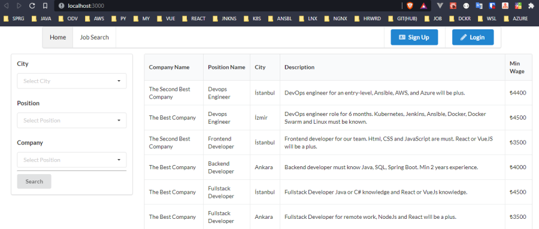
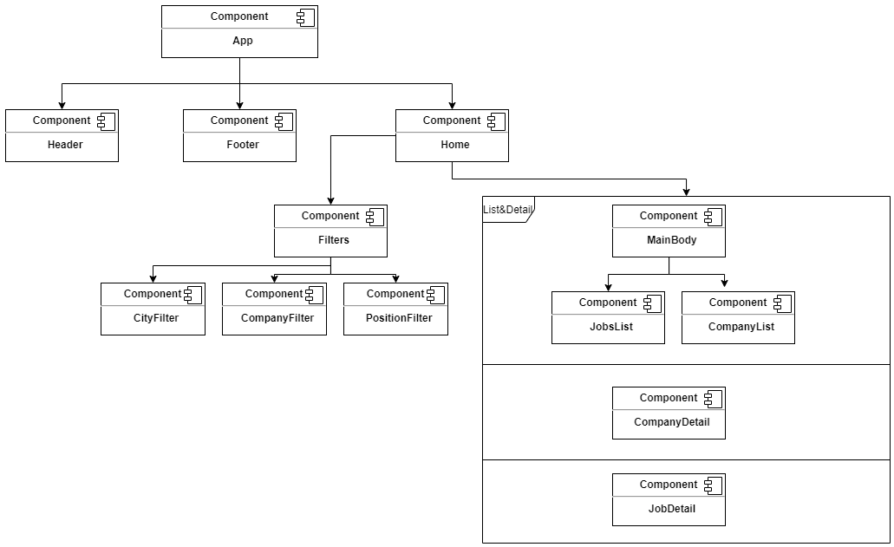

# Day 11 Assignment 1

## Requirements

For all requirements in our HRMS system;

- Create a React project.
- Model your component hierarchy using the "UML component diagram" technique. (research)
- Add your model image to your github readme file.
- Build your React components.
- Build all your React Components only by design.
- Write JavaScript services and axios codes for all requests. Do not bind them to React components. (Post,Put,Delete search)
- Link only listing requests with your JS service.

## Solution ScreenShots and Project Link

- **[HRMS Project Assignment Branch Please Click to See Branch](https://github.com/jokerinya2013/javaReact/tree/day11assignment1/hrms)**

- **[HRMS Project Frontend Please Click to See Project Folder](https://github.com/jokerinya2013/javaReact/tree/master/hrms/clientApp)**

- UI

- UI Components Chart

# Gun 9 Odev 1

## Gereklilikler

HRMS sistemimizde tüm isterler için;

- Bir adet React projesi oluşturunuz.
- Component hiyerarşinizi "UML component diagram" tekniğini kullanarak modelleyiniz. (araştırma)
- Model görselinizi github readme dosyanıza ekleyiniz.
- React componentlerinizi oluşturunuz.
- Tüm React Componentlerinizi sadece tasarımsal olarak oluşturunuz.
- Tüm isterler için JavaScript servislerini ve axios kodlarını yazınız. Bunları React componentlerine bağlamayınız. (Post,Put,Delete araştırma)
- Sadece listeleme olan isterleri JS servisinizle bağlayınız.
