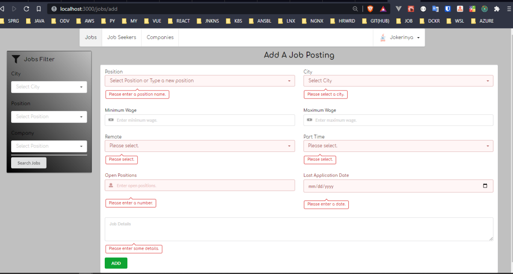
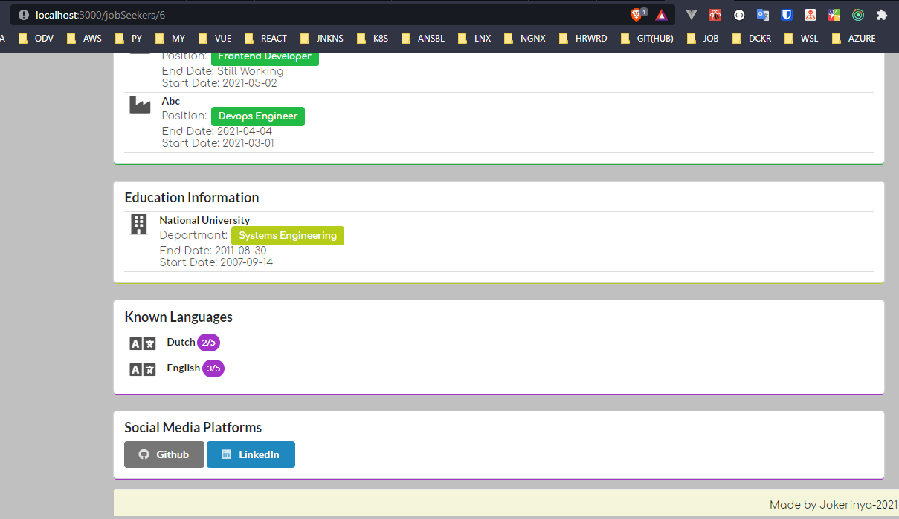

# Day 12 Assignment 1

## Requirements

1. Req 14 : Employers should be able to enter from the box, which is suitable for on-site or remote work when sharing a job posting.

2. Req 15: Employers should be able to enter the runtime feature of the job from the selected box. (For example: Part-time, full-time...)

3. Req 16 : Job postings entered by employers should be published when approved by Hrms staff.

4. Req 17 : Create the design of your forms using Formik. Connect to Backend (Research and application) https://formik.org/

## Solution ScreenShots and Project Link

- **[HRMS Project Assignment Branch Please Click to See Branch](https://github.com/jokerinya2013/javaReact/tree/day12assignment1/hrms)**

- **[HRMS Project Frontend Please Click to See Project Folder](https://github.com/jokerinya2013/javaReact/tree/master/hrms/clientApp)**

- Job Add Form Screen Shoots

- Job Filter Screen Shoots

- Cv Details Screen Shoots

# Gun 12 Odev 1

## Gereklilikler

1. Req 14 : İş verenler, iş ilanı paylaşırken işin yerinde veya uzaktan çalışma türlerinden hangisine uygun olduğunu seçilir kutudan girebilmelidir.

2. Req 15 : İş verenler işin çalışma zamanı özelliğini seçilir kutudan girebilmelidir. (Örneğin : Yarı Zamanlı, tam zamanlı...)

3. Req 16 : İş verenler tarafından girilen iş ilanları Hrms personeli tarafından onaylandığında yayına geçmelidir.

4. Req 17 : Formik kullanarak formlarınızın tasarımını oluşturunuz. Backend'e bağlayınız (Araştırma ve uygulama) https://formik.org/
