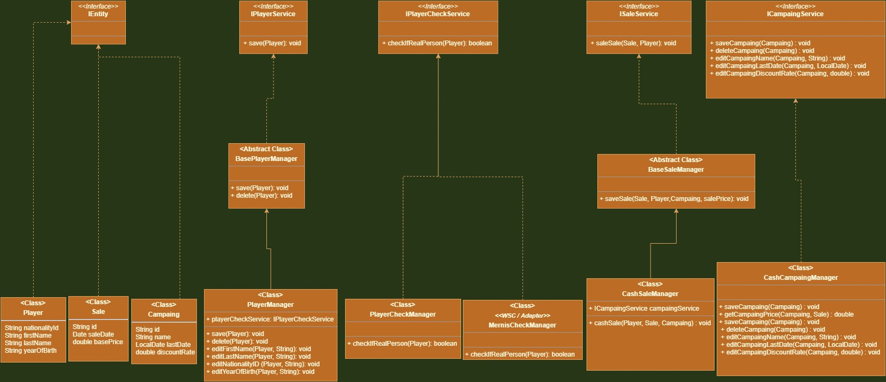

# Day 4 Assignment 3

## Requirements

1. Simulate an environment where players can register to the system, update their information, and delete their records. We want to verify the accuracy of customer information using e-government systems.

2. Simulate the sales environment where the game can be sold. (The sales made must be associated with the player. _The player in the method as a parameter._)

3. Simulate the possibilities of entering a new campaign into the system, deleting and updating the campaign.

4. Simulate campaign integration in sales.

## Solution

- For player cheking used NVKI [Web Service Client](https://tckimlik.nvi.gov.tr/Service/KPSPublic.asmx?WSDL) .

- Compiler must be 1.8 for WSC.

# Gun 2 Odev 3

Gereksinimler

1. Oyuncuların sisteme kayıt olabileceği, bilgilerini güncelleyebileceği, kayıtlarını silebileceği bir ortamı simule ediniz. Müşteri bilgilerinin doğruluğunu e-devlet sistemlerini kullanarak doğrulama yapmak istiyoruz. (E-devlet sistemlerinde doğrulama TcNo, Ad, Soyad, DoğumYılı bilgileriyle yapılır. Bunu yapacak servisi simule etmeniz yeterlidir.) (Loglama gibi)

2. Oyun satışı yapılabilecek satış ortamını simule ediniz.( Yapılan satışlar oyuncu ile ilişkilendirilmelidir. Oyuncunun parametre olarak metotta olmasını kastediyorum.)

3. Sisteme yeni kampanya girişi, kampanyanın silinmesi ve güncellenmesi imkanlarını simule ediniz.

4. Satışlarda kampanya entegrasyonunu simule ediniz.

## Cevap

- NVKI'nin [Web Service Client](https://tckimlik.nvi.gov.tr/Service/KPSPublic.asmx?WSDL) ' i kullanildi.

- Compile 1.8 olmalidir.
