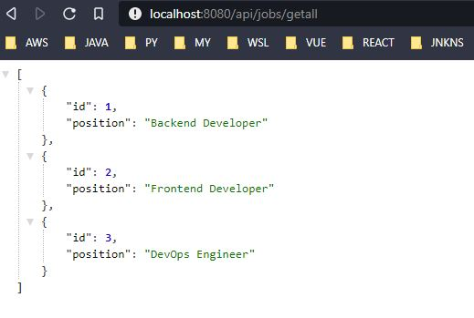
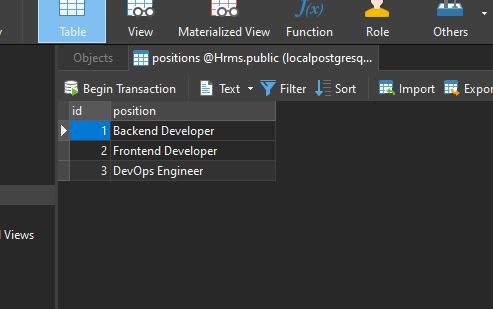

# Day 6 Assignment 3

## Requirements

- Create your project named _["hrms"](https://github.com/jokerinya2013/javaReact/tree/master/hrms)_ with Spring Boot.
- Write down the layers.
- Type the api that will list the general job positions in the system.

## Solution ScreenShot

# Gun 6 Odev 3

## Gereklilikler

- Spring Boot ile _["hrms"](https://github.com/jokerinya2013/javaReact/tree/master/hrms)_ isimli projenizi oluşturunuz.
- Katmanları yazınız.
- Sistemde bulunan genel iş pozisyonlarını listeleyecek api'yi yazınız.
