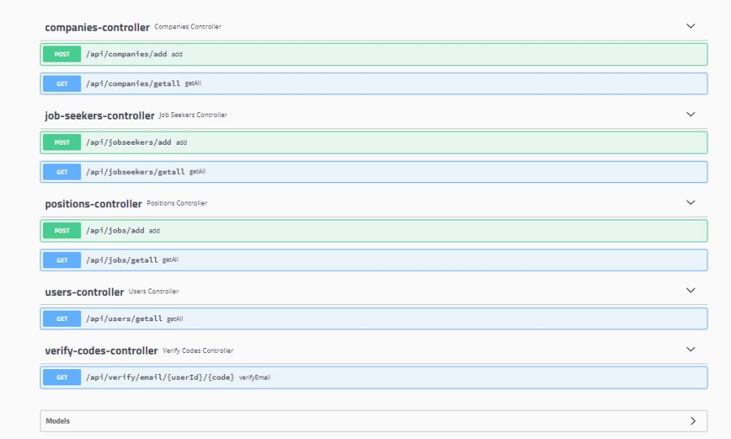

# Day 7 Assignment 3

## Requirements

- Before modeling, put the following requirements into the code.

- ** IMPORTANT 1: Create fake services for verification. For example, you don't really need to send mail. **

- ** IMPORTANT 2: Do not code beyond the requirements. This is a software developer behavior against Project management and ALM (Application LifeCycle Management) rules. **

1. Req 1: Job Seekers must be able to register to the system.

   _Accept conditions:_

   - During registration, the user is asked for name, surname, tcno, year of birth, e-mail, password, password repetition information.
   - All fields are required. The user is informed.
   - Mernis verification is done and the system is registered.
   - If the verification is not valid, the user is informed.
   - If there is a previously registered e-mail or tcno, no registration will be made. The user is informed.
   - Email verification is required for registration to occur.

2. Req 2: Employers should be able to register in the system.

   _Accept conditions:_

   - During the registration, the user is asked for company name, website, e-mail, phone, password, password repeat information with the same domain as the website.
   - The aim here is to prevent non-companies from joining the system.
   - All fields are required. The user is informed.
   - Company records are verified in two ways. Email verification is required for registration to occur. Approval from HRMS staff (our :) is required.
   - If there is a registered e-mail before, registration will not take place. The user is informed.

3. Req 3: General job position names should be added to the system. For example Software Developer, Software Architect.

   _Accept conditions:_

   - These positions cannot be repeated. The user is warned.

4. Req 4: Employers should be able to be listed. (Entire list only)

5. Req 5: Job seekers should be able to be listed. (Entire list only)

6. Req 6: Job positions should be listed. (Entire list only)

## Solution ScreenShots and Project Link

- Apis and Controllers

- Project Structure

- [HRMS Project](https://github.com/jokerinya2013/javaReact/tree/master/hrms)

# Gun 7 Odev 3

## Gereklilikler

- Daha önce modellemesini yaptığınız aşağıdaki gereksinimleri koda dökünüz.

- **ÖNEMLİ 1 : Doğrulama işlemleri için sahte servisler oluşturunuz. Örneğin, gerçekten mail göndermeniz gerekmez.**

- **ÖNEMLİ 2 : Gereksinimler dışında kodlama yapmayınız. Bu, Proje yönetimi ve ALM (Application LifeCycle Management) kurallarına aykırı bir yazılım geliştirici davranışıdır.**

1. Req 1 : İş Arayanlar sisteme kayıt olabilmelidir.

   _Kabul Kriterleri:_

   - Kayıt sırasında kullanıcıdan ad, soyad, tcno, doğum yılı, e-Posta, şifre, şifre tekrarı bilgileri istenir.
   - Tüm alanlar zorunludur. Kullanıcı bilgilendirilir.
   - Mernis doğrulaması yapılarak sisteme kayıt gerçekleştirilir.
   - Doğrulama geçerli değilse kullanıcı bilgilendirilir.
   - Daha önce kayıtlı bir e-posta veya tcno var ise kayıt gerçekleşmez. Kullanıcı bilgilendirilir.
   - Kayıdın gerçekleşmesi için e-posta doğrulaması gerekir.

2. Req 2 : İş verenler sisteme kayıt olabilmelidir.

   _Kabul Kriterleri:_

   - Kayıt sırasında kullanıcıdan şirket adı, web sitesi, web sitesi ile aynı domaine sahip e-posta, telefon, şifre, şifre tekrarı bilgileri istenir.
   - Burada amaç sisteme şirket olmayanların katılmasını engellemektir.
   - Tüm alanlar zorunludur. Kullanıcı bilgilendirilir.
   - Şirket kayıtları iki şekilde doğrulanır. Kayıdın gerçekleşmesi için e-posta doğrulaması gerekir. HRMS personelinin (bizim :)) onayı gerekmektedir.
   - Daha önce kayıtlı bir e-posta var ise kayıt gerçekleşmez. Kullanıcı bilgilendirilir.

3. Req 3 : Sisteme genel iş pozisyonu isimleri eklenebilmelidir. Örneğin Software Developer, Software Architect.

   _Kabul Kriterleri:_

   - Bu pozisyonlar tekrar edemez. Kullanıcı uyarılır.

4. Req 4 : İş verenler listelenebilmelidir. (Sadece tüm liste)

5. Req 5 : İş arayanlar listelenebilmelidir. (Sadece tüm liste)

6. Req 6 : İş pozisyonları listelenebilmelidir. (Sadece tüm liste)
