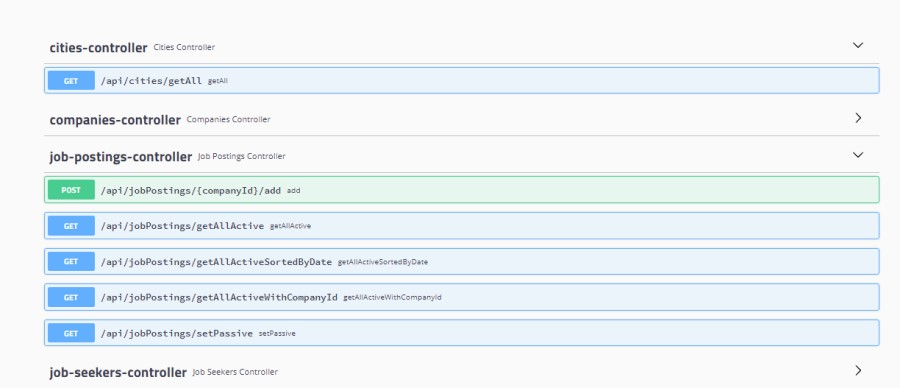
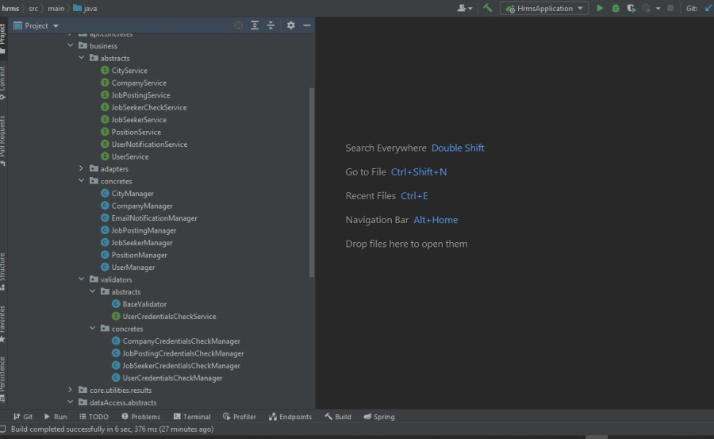
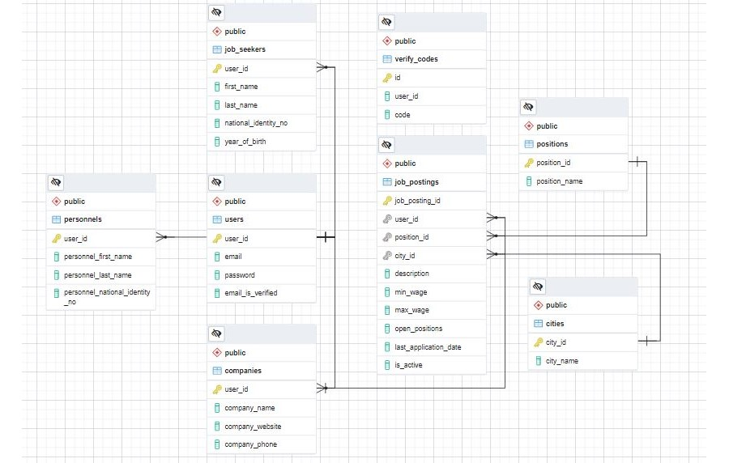

# Day 8 Assignment 1

## Requirements

**Important: These requirements have been written without making any distinction between backend and frontend. (As in the industry). You should code the necessary parts for the backend.**

1. Req 7 : Employers should be able to add job postings to the system.

   In the job posting form;

   - General job position can be selected from the dropdown list. (For example, Java Developer) (Required)
   - Job description entry should be possible. (For example; For our company, he is proficient in languages ​​such as JAVA, C # etc....)(Required)
   - City information should be able to be selected from the drop-down list. (Compulsory)
   - It should be possible to enter min-max for the salary scale. (Optional)
   - It should be possible to enter the number of open positions. (Compulsory)
   - The application deadline must be entered.

2. Req 8: All active job postings in the system should be listed.

   - The list must come in tabular form.
   - The list should include company name, general job position name, number of open positions, publication date, deadline date information.

3. Req 9 : All active job postings in the system should be listed by date.

   - The list must come in tabular form.
   - Company name, general job position name, number of open positions, publication date, deadline should be in the list.

4. Req 10: All active job postings belonging to a company should be listed in the system.

   - The list must come in tabular form.
   - The list should include company name, general job position name, number of open positions, publication date, deadline date information.

5. Req 11 : Employers should be able to close a job posting in the system. (Passive posting)

## Solution ScreenShots and Project Link

- **[HRMS Project Assignment Branch](https://github.com/jokerinya2013/javaReact/tree/day8assignment1/hrms)**

- Apis and Controllers

- Project Structure

- DB Diagram

# Gun 8 Odev 1

## Gereklilikler

**Önemli : Bu isterler backend-frontend ayırımı yapılmaksızın yazılmıştır. (Sektördeki gibi). Siz backend için gerekli kısımları kodlamalısınız.**

1. Req 7 : İş verenler sisteme iş ilanı ekleyebilmelidir.

   İş ilanı formunda;

   - Seçilebilir listeden (dropdown) genel iş pozisyonu seçilebilmelidir.(Örneğin Java Developer)(Zorunlu)
   - İş tanımı girişi yapılabilmelidir. (Örneğin; firmamız için JAVA, C# vb. dillere hakim....)(Zorunlu)
   - Şehir bilgisi açılır listeden seçilebilmelidir. (Zorunlu)
   - Maaş skalası için min-max girişi yapılabilmelidir. (Opsiyonel)
   - Açık pozisyon adedi girişi yapılabilmelidir. (Zorunlu)
   - Son başvuru tarihi girişi yapılabilmelidir.

2. Req 8 : Sistemdeki tüm aktif iş ilanları listelenebilmelidir.

   - Liste, tablo formunda gelmelidir.
   - Listede firmadı, genel iş pozisyonu adı, açık pozisyon adedi, yayın tarihi, son başvuru tarihi bilgileri olmalıdır.

3. Req 9 : Sistemdeki tüm aktif iş ilanları tarihe göre listelenebilmelidir.

   - Liste, tablo formunda gelmelidir.
   - Listede firmadı, genel iş pozisyonu adı, açık pozisyon adedi, yayın tarihi, son başvuru tarihi bilgileri olmalıdır.

4. Req 10 : Sistemde bir firmaya ait tüm aktif iş ilanları listelenebilmelidir.

   - Liste, tablo formunda gelmelidir.
   - Listede firmadı, genel iş pozisyonu adı, açık pozisyon adedi, yayın tarihi, son başvuru tarihi bilgileri olmalıdır.

5. Req 11 : İş verenler sistemdeki bir ilanı kapatabilmelidir. (Pasif ilan)
