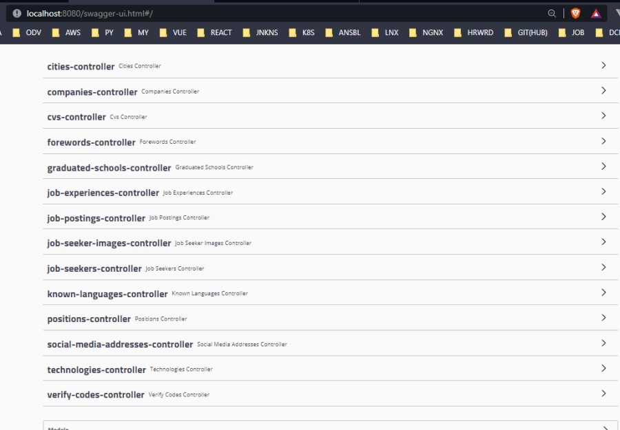
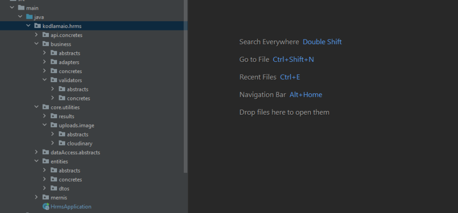
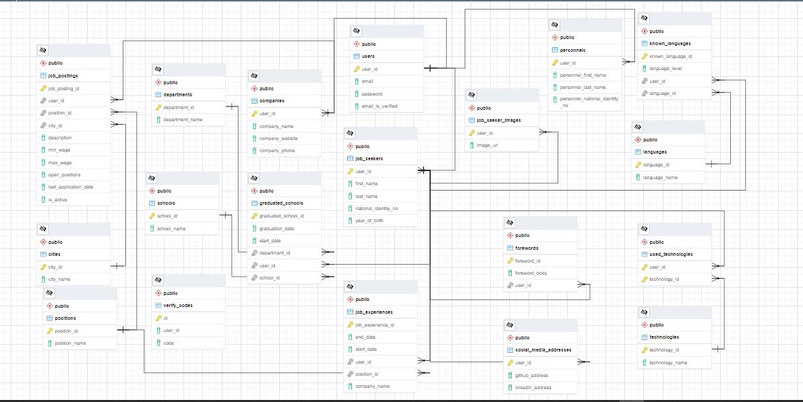

# Day 9 Assignment 1

## Requirements

1. Req 12: Candidates should be able to enter their CV into the system.

   - Candidates should be able to add their schools to the system. (School name, department)
   - These schools should be able to enter the years they studied in the system.
   - If he has not graduated, the graduation year should be blank.
   - The schools of the candidates should be in reverse order according to the graduation year.
   - If not graduated, this school should be displayed at the top and as "in progress".
   - Candidates should be able to enter their work experience. (Business name, position)
   - They should be able to enter into the system in which years they had these experiences.
   - If he is still working, the year of leaving the job should be empty.
   - Candidates' experience should be in reverse order by year. If it is still running, this experience should still be displayed at the top and as "in progress".
   - Candidates should be able to enter the foreign languages ​​they know into the system. ( Language, Level -> 1-5)
   - Candidates must be able to enter photos into the system. The photo of the candidate will be kept in the https://cloudinary.com/pricing system. (External service integration) Use the free account.
   - Candidates should be able to enter their github addresses into the system.
   - Candidates should be able to enter their linkedin addresses into the system.
   - Candidates should be able to enter the programming languages ​​or technologies they know into the system. (Programming/Technology name) For example; React.
   - Candidates should be able to add a cover letter to the system. (For example: I love to work...)

## Solution ScreenShots and Project Link

- **[HRMS Project Assignment Branch Please Click to See Branch](https://github.com/jokerinya2013/javaReact/tree/day9assignment1/hrms)**

- Apis and Controllers

- Project Structure

- DB Diagram

# Gun 9 Odev 1

## Gereklilikler

1. Req 12: Adaylar sisteme CV girişi yapabilmelidir.

   - Adaylar okudukları okulları sisteme ekleyebilmelidir. (Okul adı, bölüm)
   - Bu okullarda hangi yıllarda okuduklarını sisteme girebilmelidir.
   - Eğer mezun değilse mezuniyet yılı boş geçilebilmelidir.
   - Adayların okudukları okullar mezuniyet yılına göre tersten sıralanabilmelidir.
   - Mezun olunmamışsa yine bu okul en üstte ve "devam ediyor" olarak görüntülenmelidir.
   - Adaylar iş tecübelerini girebilmelidir. (İş yeri adı, pozisyon)
   - Bu tecrübelerini hangi yıllarda yaptıklarını sisteme girebilmelidir.
   - Eğer hala çalışıyorsa işten ayrılma yılı boş geçilebilmelidir.
   - Adayların tecrübeleri yıla göre tersten sıralanabilmelidir. Hala çalışıyorsa yine bu tecrübesi en üstte ve "devam ediyor" olarak görüntülenmelidir.
   - Adaylar bildikleri yabancı dilleri sisteme girebilmelidir. ( Dil, Seviye -> 1-5 )
   - Adaylar sisteme fotoğraf girebilmelidir. Adaya ait fotoğraf https://cloudinary.com/pricing sisteminde tutulacaktır. (Dış servis entegrasyonu) Ücretsiz hesabı kullanınız.
   - Adaylar sisteme github adreslerini girebilmelidir.
   - Adaylar sisteme linkedin adreslerini girebilmelidir.
   - Adaylar bildikleri programlama dillerini veya teknolojilerini sisteme girebilmelidir. (Programlama/Teknoloji adı) Örneğin; React.
   - Adaylar sisteme ön yazı ekleyebilmelidir. (Örneğin: Çalışmayı çok severim...)
