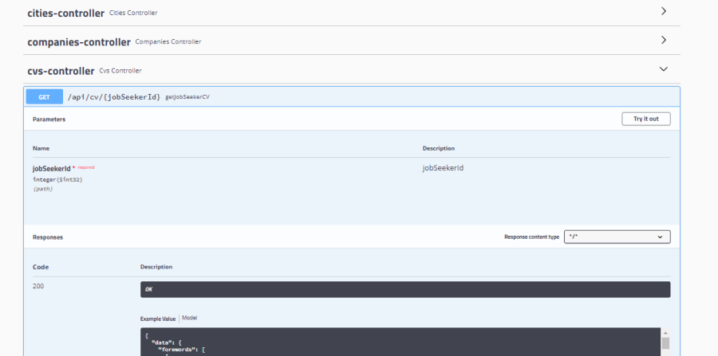
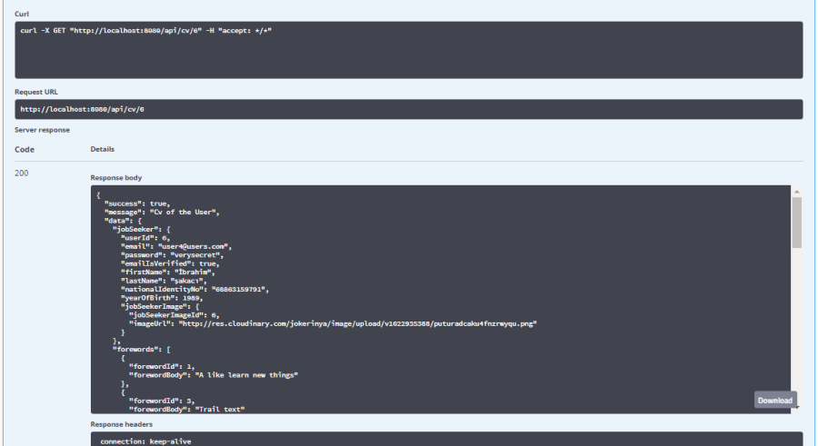

# Day 9 Assignment 2

## Requirements

1. Req 13 : All CV information of a candidate should be displayed.

## Solution ScreenShots and Project Link

- **[HRMS Project Assignment Branch Please Click to See Branch](https://github.com/jokerinya2013/javaReact/tree/day9assignment2/hrms)**

- Apis and Controllers-1



- Apis and Controllers-2



- [Sample Output](cv-sample.json)

```json{
  "success": true,
  "message": "Cv of the User",
  "data": {
    "jobSeeker": {
      "userId": 6,
      "email": "user4@users.com",
      "password": "verysecret",
      "emailIsVerified": true,
      "firstName": "İbrahim",
      "lastName": "şakacı",
      "nationalIdentityNo": "68863159791",
      "yearOfBirth": 1989,
      "jobSeekerImage": {
        "jobSeekerImageId": 6,
        "imageUrl": "http://res.cloudinary.com/jokerinya/image/upload/v1622935388/puturadcaku4fnzrwyqu.png"
      }
    },
    "forewords": [
      {
        "forewordId": 1,
        "forewordBody": "A like learn new things"
      },
      {
        "forewordId": 3,
        "forewordBody": "Trail text"
      }
    ],
    "jobExperiences": [
      {
        "jobExperienceId": 4,
        "position": {
          "positionId": 4,
          "positionName": "fullstack developer"
        },
        "startDate": "2021-03-01",
        "endDate": null,
        "companyName": "digisolution"
      },
      {
        "jobExperienceId": 1,
        "position": {
          "positionId": 4,
          "positionName": "fullstack developer"
        },
        "startDate": "2019-09-03",
        "endDate": "2020-08-03",
        "companyName": "telecom"
      },
      {
        "jobExperienceId": 3,
        "position": {
          "positionId": 2,
          "positionName": "frontend developer"
        },
        "startDate": "2019-11-03",
        "endDate": "2020-03-03",
        "companyName": "unicoaero"
      },
      {
        "jobExperienceId": 5,
        "position": {
          "positionId": 5,
          "positionName": "project manager"
        },
        "startDate": "2021-12-09",
        "endDate": null,
        "companyName": "tesla"
      }
    ],
    "graduatedSchools": [],
    "technologies": [
      {
        "technologyId": 1,
        "technologyName": "react"
      },
      {
        "technologyId": 2,
        "technologyName": "java"
      }
    ],
    "knownLanguages": [
      {
        "knownLanguageId": 2,
        "language": {
          "languageId": 2,
          "languageName": "english"
        },
        "languageLevel": 3
      },
      {
        "knownLanguageId": 1,
        "language": {
          "languageId": 1,
          "languageName": "french"
        },
        "languageLevel": 4
      }
    ],
    "socialMediaAddress": {
      "socialMediaId": 6,
      "githubAddress": "number@github.com",
      "linkedinAddress": "numba@linkedin.com"
    }
  }
}
```

# Gun 9 Odev 2

## Gereklilikler

1. Req 13 : Bir adaya ait tüm CV bilgisi görüntülenebilmelidir.
